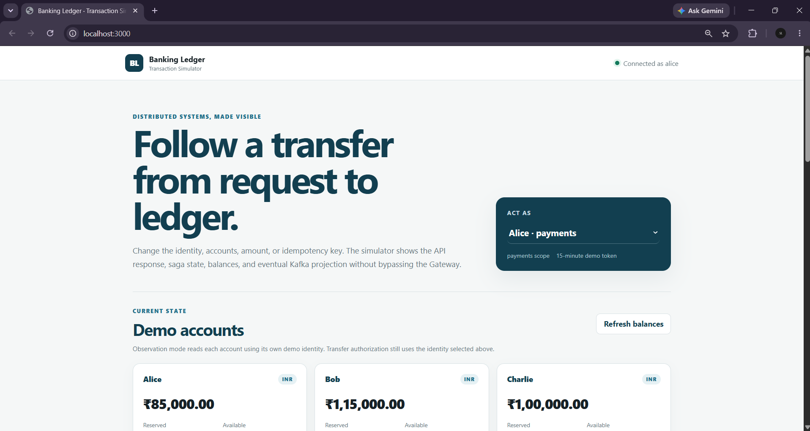
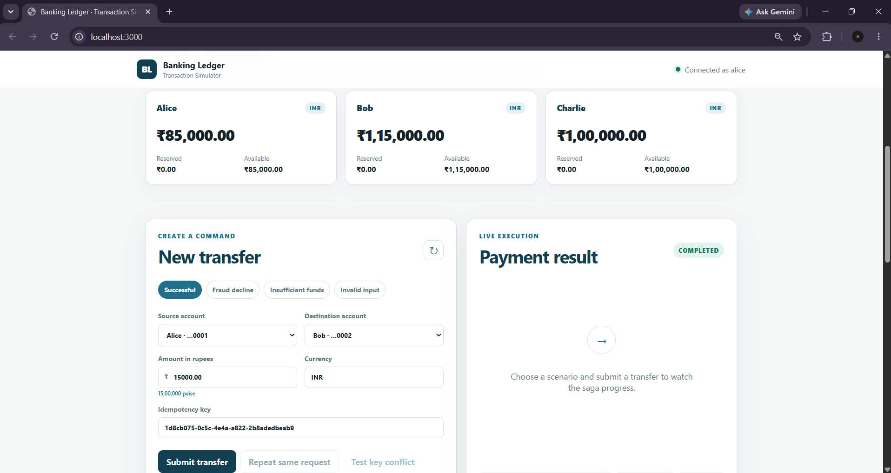
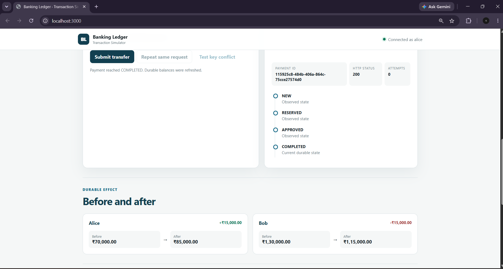
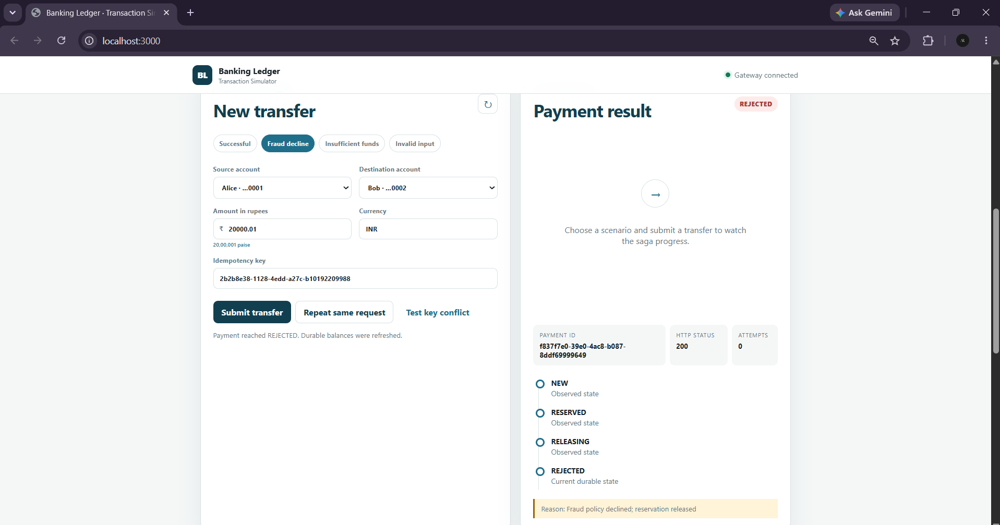
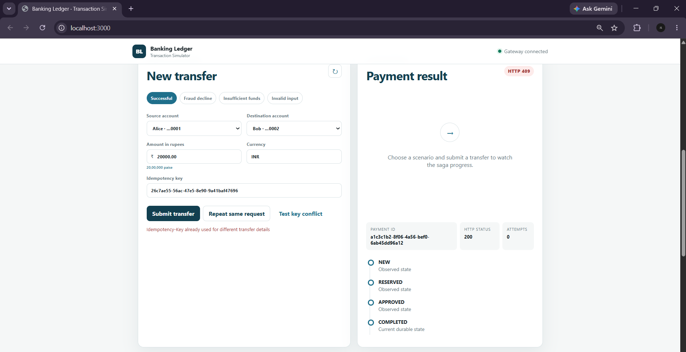
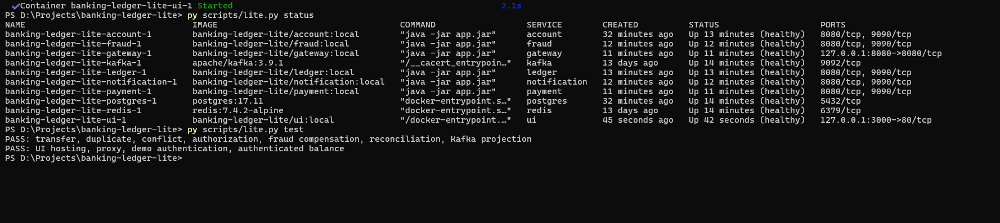
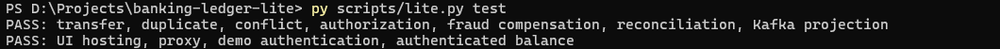
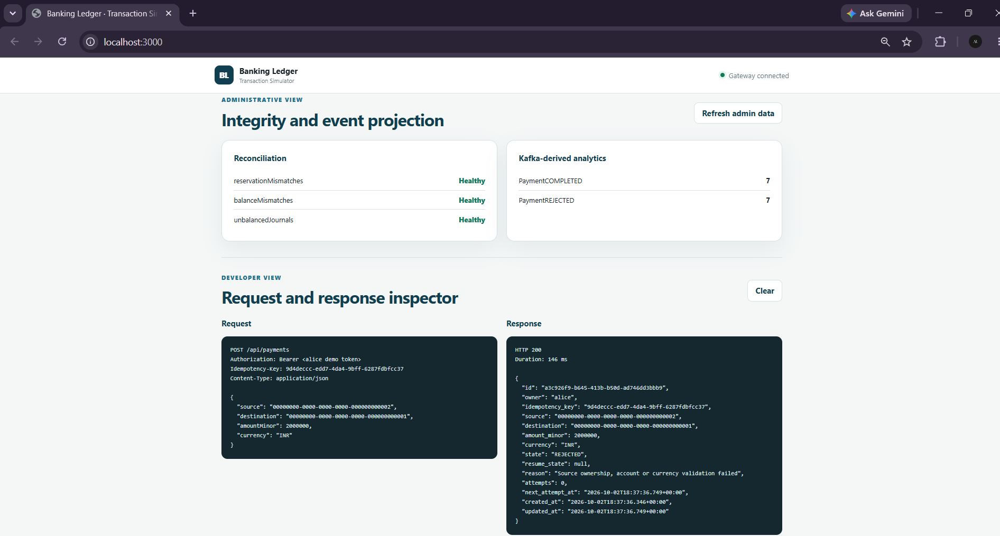

# Banking Ledger Lite — Java 21

A separate, lower-memory configuration of the Distributed Banking Ledger and Payment System, intended for testing on a Windows laptop with 8 GB RAM. It retains the six services, PostgreSQL, Kafka, Redis, durable payment saga, double-entry ledger and authorization logic. A lightweight browser-based transaction simulator now demonstrates input changes, saga outcomes, balances, reconciliation, and Kafka-derived analytics.

The nine-container backend baseline was smoke-tested on a Windows laptop with 8 GB installed RAM and 3.49 GiB reported to Docker. All backend containers became healthy, and the measured backend total after that smoke test was about 2.25 GiB. The later Nginx transaction simulator adds a tenth runtime container with a 64 MiB limit; it does not change the backend correctness path. The configured ten-container limits total 3,312 MiB (about 3.23 GiB), excluding Windows, Docker/WSL overhead and other applications. These are bounded functional observations, not a sustained-load benchmark or a guarantee for every 8 GB machine. Keep IntelliJ closed during the first build and test.


## Application Demo

The browser-based transaction simulator sends authenticated requests through the API Gateway and displays payment state transitions, durable balance effects, fraud compensation, idempotency behavior, reconciliation results, and Kafka-derived analytics.



### Successful transfer

The following example shows an authenticated transfer progressing through the payment saga and reaching `COMPLETED`.



The ledger posts equal debit and credit entries and the interface displays the durable before-and-after balances.



### Failure and consistency scenarios

| Fraud rejection and compensation | Idempotency conflict |
|---|---|
|  |  |

A payment above the configured fraud threshold is reserved, rejected and released without a final posted balance change. Reusing an idempotency key with changed transfer details produces HTTP `409 Conflict`.

### Runtime verification

All six Spring Boot services, PostgreSQL, Kafka, Redis and the Nginx transaction simulator run as ten Docker containers.



The end-to-end smoke test verifies transfer processing, duplicate requests, idempotency conflicts, authorization, fraud compensation, reconciliation, Kafka projection, UI hosting, proxying and demo authentication.



### Reconciliation and analytics

The administrator view reports double-entry ledger reconciliation results and Kafka-derived terminal payment metrics.




## Start on Windows

Install Docker Desktop with Linux containers / WSL 2 and Python 3. A local JDK or Maven installation is not required for this workflow. The builder image includes Java 21 and Maven.

1. Extract this archive into a new folder, such as `C:\Projects\banking-ledger-lite`.
2. Open Docker Desktop and wait for its engine to start.
3. Stop the original full project if it is running: it also uses port 8080 and competes for RAM. The lite launcher deliberately manages only its own named project.
4. Open PowerShell in this extracted folder and run:

```powershell
py scripts/lite.py start
```

Alternatively run `.\start-lite.bat`. If your Python command is `python`, use that instead of `py`. On Linux/macOS use `python3 scripts/lite.py start`.

The launcher creates a local `.env`, validates Compose, stops any running containers belonging to this lite project, prepares the Kafka volume for the official image's non-root user, builds all Java modules sequentially in one 768 MiB builder container, packages six Java runtime images plus the Nginx UI, and starts the ten base containers one at a time. Each container must pass its health/readiness check before the launcher starts the next. Existing data volumes are preserved. It will stop on a build or readiness failure rather than print a false success.

When startup completes, open the transaction simulator:

```text
http://localhost:3000
```

The raw API remains available at `http://localhost:8080`.

The first run requires image and dependency downloads and can be slow. The Maven cache is persisted across builds. Do not use `docker compose up --build` for the first run: runtime images expect JARs created by the dedicated builder.

## Verify the running system

```powershell
py scripts/lite.py test
py scripts/lite.py stats
```

Expected smoke-test output:

```text
PASS: transfer, duplicate, conflict, authorization, fraud compensation, reconciliation, Kafka projection
PASS: UI hosting, proxy, demo authentication, authenticated balance
```

`stats` shows actual container memory, CPU and process counts on your device. Also inspect total memory in Windows Task Manager: container memory alone does not tell you whether the host is swapping.

If startup fails or a service restarts:

```powershell
py scripts/lite.py status
py scripts/lite.py report
py scripts/lite.py logs ledger
```

`report` writes `lite-diagnostics.txt` with container status, restart counts, OOM indicators and memory readings. It does not dump environment credentials. Share that report and the relevant error when troubleshooting. The report is ignored by Git.

## Daily commands

| Action | Command |
| --- | --- |
| Check Docker and its reported VM memory | `py scripts/lite.py check` |
| Build/rebuild and start | `py scripts/lite.py start` |
| Restart using already-built images | `py scripts/lite.py start --skip-build` |
| Run the end-to-end smoke test | `py scripts/lite.py test` |
| Check actual memory | `py scripts/lite.py stats` |
| Check container status | `py scripts/lite.py status` |
| Save a diagnostic snapshot | `py scripts/lite.py report` |
| Inspect recent logs | `py scripts/lite.py logs payment` |
| Stop this stack, keeping data | `py scripts/lite.py stop` |

`start` intentionally stops the lite stack before building, so the compiler does not compete with the running services. It can interrupt a test session; payment state and data are retained for recovery. Use `--skip-build` only when the images already exist and your code has not changed.

## Resource changes

| Component | Lightweight setting |
| --- | --- |
| Each Java service | 384 MiB container limit; 32 MiB initial / 128 MiB maximum Java heap |
| Six Java services together | 2,304 MiB combined container limits |
| Transaction simulator | 64 MiB Nginx container; static HTML/CSS/JavaScript |
| JVM | Serial GC, smaller code cache/direct-memory budget, bounded processor count |
| Tomcat | 12 worker threads; 1 spare thread; 64 connections |
| Database connection pools | At most 3 connections per service, 0 minimum idle |
| PostgreSQL | 256 MiB container limit; 32 MiB shared buffers; 30 connections |
| Kafka | 640 MiB container limit; 128–256 MiB broker heap; fewer worker threads |
| Redis | 48 MiB container limit; 16 MiB data limit, no eviction |
| Builder | 768 MiB container limit; 384 MiB Maven heap; modules built sequentially |
| Startup | One service at a time, with readiness checks |
| Observability | Trace export and Prometheus export disabled; no dashboard/collector containers |

The Java heap is only part of each process's memory; class metadata, stacks, native libraries and direct buffers need headroom. Health checks also consume resources. Kafka's command-line health probe has its own small heap settings so it does not start with an unnecessarily large default heap.

No PostgreSQL durability setting (`fsync`, `synchronous_commit`, `full_page_writes`) was disabled. Kafka still uses `acks=all` and producer idempotence; the consumer still commits after its database work. The bank's balance locks, journal constraints, ownership checks, outbox/inbox and saga transitions are unchanged. The single-node local infrastructure still provides no high-availability guarantee.

Smaller pools and heaps reduce throughput and increase latency under load. This variant is for small learning workloads. Do not load-test it while expecting the same response times as a larger deployment.

## API example

The gateway is at `http://localhost:8080`. The local transaction simulator is at `http://localhost:3000`. It uses a demo-only identity switcher, not a public signup or production authentication system.

Accounts are seeded with simulated money: `alice`, `bob`, `charlie`, each with Rs 100,000. Their account IDs end in `0001`, `0002`, and `0003`, respectively. Rs 10,000 is `1000000` paise. The default demo fraud rule allows transfers up to Rs 20,000.

PowerShell:

```powershell
$token = py scripts/token.py alice
$headers = @{
    Authorization = "Bearer $token"
    "Idempotency-Key" = [guid]::NewGuid().ToString()
}
$body = @{
    source = "00000000-0000-0000-0000-000000000001"
    destination = "00000000-0000-0000-0000-000000000002"
    amountMinor = 1000000
    currency = "INR"
} | ConvertTo-Json
$payment = Invoke-RestMethod -Uri "http://localhost:8080/api/payments" -Method Post -Headers $headers -ContentType "application/json" -Body $body
$payment
Invoke-RestMethod -Uri "http://localhost:8080/api/payments/$($payment.id)" -Headers @{ Authorization = "Bearer $token" }
```

Repeat the status request after a few seconds to see the terminal result. Reusing the same idempotency key with the same input returns the same payment. Different input with that key returns 409. The smoke test spends simulated funds; repeated tests eventually need funds transferred back or a deliberately fresh demo environment.

## Files and tests

- `docs/LIGHTWEIGHT-CHANGES.md`: technical differences and tradeoffs.
- `docs/VALIDATION.md`: checks performed for this variant and unverified gates.
- `docs/PROJECT-DESCRIPTION.md`: architecture and concept-to-code mapping.
- `docs/API.md`: internal service contracts.
- `docs/FAILURE-LAB.md`: outage and recovery exercises.
- `docs/FRONTEND-INTEGRATION.md`: UI architecture, integration steps, scenarios, and troubleshooting.
- `.github/workflows/ci.yml`: full Java integration tests, lite startup and smoke test.

Application source is unchanged except for an added test of profile loading. Runtime tuning is isolated to `bank-common-lite.yml`, Compose, Dockerfile and launch/build scripts. The original downloadable archive remains a separate project.

The source code archive is small, but the build still downloads Java, Maven, infrastructure images and dependencies. This reduces memory demand; it does not eliminate the disk requirements of a Java microservices project.

## GitHub

Upload the extracted source folder, not the generated `.env`, `build/`, `target/` directories or diagnostic report. `.gitignore` covers these. `.gitattributes` preserves LF endings for the shell scripts when checked out on Windows. Use a separate repository or branch for this lite variant so the two configurations remain easy to compare.

The Docker project name is `banking-ledger-lite`, with separate volumes from the original `banking-ledger` project. Both use local port 8080. The launcher does not migrate the original database or stop unrelated projects.

For a first upload, follow `GITHUB-UPLOAD.md`. The repository intentionally has no open-source license file; add a license only after choosing the terms under which you want other people to use the code.
